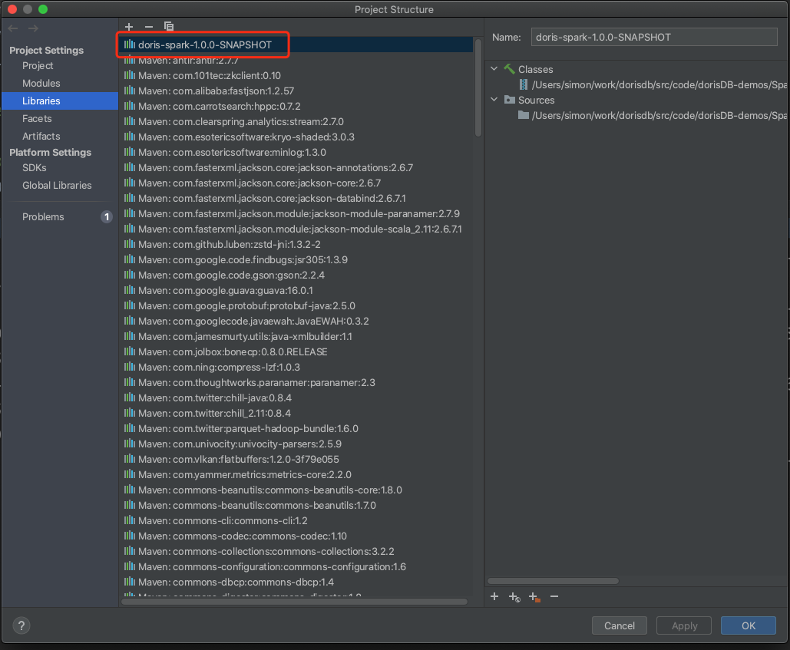

# 02_sparkConnector2DorisDB

##  Description

- Read DorisDB table via spark-connector
- ETL in Spark: Explode data to multiple lines
- Write results into another DorisDB table


### DataFlow

> dorisDB(bitmap table) -> spark-connector -> sparkSql ETL -> dorisDB(uid details table)

## Preparations

### prepare datas

> - demo2 re-use the data in demo1
> - uv field in demo1_spark_tb0 is bitmap type（refer to  [01_sparkStreaming2DorisDB](./01_sparkStreaming2DorisDB.md)  ）,
> - convert bitmap type to string_list and sink to DorisDB table demo1_spark_tb1


#### Source Data table DDL

```
CREATE TABLE `demo1_spark_tb1` (
    `site`   varchar(50) NULL COMMENT "",
    `date`   DATE     NULL  COMMENT "",
    `hour`   smallint NULL COMMENT "",
    `minute` smallint NULL COMMENT "",
    `uid_list_str`  String NULL  COMMENT ""
) ENGINE=OLAP
DUPLICATE KEY(`site`,`date`,  `hour` , `minute` )
COMMENT "OLAP"
DISTRIBUTED BY HASH(`site`) BUCKETS 10
PROPERTIES (
    "replication_num" = "1",
    "in_memory" = "false",
    "storage_format" = "DEFAULT"
);
```

Reuse the simulated data from demo1_spark_tb0:

```
insert into demo1_spark_tb1(site, date, hour, minute, uid_list_str)
select site,date,hour,minute, bitmap_to_string(uv)
from demo1_spark_tb0;
```

Verify the result

```
MySQL [dorisdb_demo]> select * from demo1_spark_tb1 limit 5;
+--------------------------+------------+------+--------+--------------+
| site                     | date       | hour | minute | uid_list_str |
+--------------------------+------------+------+--------+--------------+
| https://www.dorisdb.com/ | 2021-05-29 |   14 |     47 | 5282         |
| https://www.dorisdb.com/ | 2021-05-29 |   14 |     51 | 3157,7582    |
| https://www.dorisdb.com/ | 2021-05-29 |   14 |     55 | 2395,8287    |
| https://www.dorisdb.com/ | 2021-05-29 |   14 |     58 | 7021         |
| https://www.dorisdb.com/ | 2021-05-29 |   14 |     59 | 1041,9393    |
+--------------------------+------------+------+--------+--------------+
5 rows in set (0.01 sec)
```

#### target table DDL

```
CREATE TABLE `demo1_spark_tb2` (
    `uid`    INT         NULL  COMMENT "",
    `date`   DATE        NULL  COMMENT "",
    `hour`   smallint    NULL COMMENT "",
    `minute` smallint    NULL COMMENT "",
    `site`   varchar(50) NULL COMMENT ""
) ENGINE=OLAP
DUPLICATE KEY(`uid`, `date`,  `hour` , `minute` )
COMMENT "OLAP"
DISTRIBUTED BY HASH(`uid`) BUCKETS 10
PROPERTIES (
    "replication_num" = "1",
    "in_memory" = "false",
    "storage_format" = "DEFAULT"
);
```

## Performing

### add spark-connector jar into the project


### Run the demo

Compile and run com.dorisdb.spark.SparkConnector2DorisDB

> read table demo1_spark_tb1 -> sparkSql explodes to string list -> sink to demo1_spark_tb2


### Verification

```
MySQL [dorisdb_demo]> select * from demo1_spark_tb2 limit 5;
+------+------------+------+--------+---------------------------+
| uid  | date       | hour | minute | site                      |
+------+------------+------+--------+---------------------------+
|   10 | 2021-05-29 |   16 |     52 | https://docs.dorisdb.com/ |
|   17 | 2021-05-29 |   16 |     38 | https://www.dorisdb.com/  |
|   18 | 2021-05-29 |   15 |     30 | https://www.dorisdb.com/  |
|   18 | 2021-05-29 |   16 |     58 | https://www.dorisdb.com/  |
|   20 | 2021-05-29 |   16 |     34 | https://docs.dorisdb.com/ |
+------+------------+------+--------+---------------------------+
5 rows in set (0.02 sec)
```

# License

DorisDB/demo is under the Apache 2.0 license. See the [LICENSE](../LICENSE) file for details.
