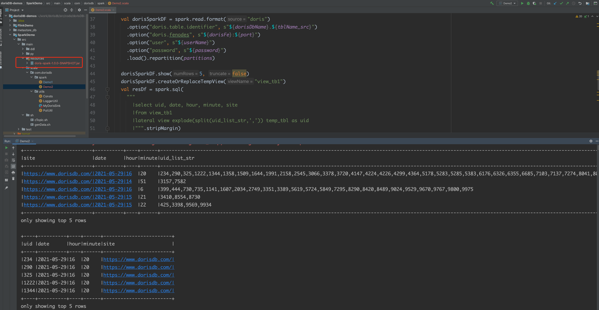

# 02_sparkConnector2StarRocks

##  Description

- Read StarRocks table via spark-connector
- ETL in Spark: Explode data to multiple lines
- Write results into another StarRocks table


### DataFlow

> StarRocks(bitmap table) -> spark-connector -> sparkSql ETL -> StarRocks(uid details table)

## Preparations

### prepare datas

> - demo2 re-use the data in demo1
> - uv field in demo1_spark_tb0 is bitmap type（refer to  [01_sparkStreaming2StarRocks](./01_sparkStreaming2StarRocks.md)  ）,
> - convert bitmap type to string_list and sink to StarRocks table demo1_spark_tb1


#### Source Data table DDL

```
CREATE TABLE `demo1_spark_tb1` (
    `site`   varchar(50) NULL COMMENT "",
    `date`   DATE     NULL  COMMENT "",
    `hour`   smallint NULL COMMENT "",
    `minute` smallint NULL COMMENT "",
    `uid_list_str`  String NULL  COMMENT ""
) ENGINE=OLAP
DUPLICATE KEY(`site`,`date`,  `hour` , `minute` )
COMMENT "OLAP"
DISTRIBUTED BY HASH(`site`) BUCKETS 10
PROPERTIES (
    "replication_num" = "1",
    "in_memory" = "false",
    "storage_format" = "DEFAULT"
);
```

Reuse the simulated data from demo1_spark_tb0:

```
insert into demo1_spark_tb1(site, date, hour, minute, uid_list_str)
select site,date,hour,minute, bitmap_to_string(uv)
from demo1_spark_tb0;
```

Verify the result

```
MySQL [starrocks_demo]> select * from demo1_spark_tb1 limit 5;
+-----------------------------+------------+------+--------+--------------+
| site                        | date       | hour | minute | uid_list_str |
+-----------------------------+------------+------+--------+--------------+
| https://docs.starrocks.com/ | 2021-09-27 |    9 |     40 | 9855,9978    |
| https://docs.starrocks.com/ | 2021-09-27 |    9 |     41 | 3503         |
| https://docs.starrocks.com/ | 2021-09-27 |    9 |     43 | 9414,9970    |
| https://docs.starrocks.com/ | 2021-09-27 |    9 |     45 | 5902         |
| https://docs.starrocks.com/ | 2021-09-27 |    9 |     46 | 5827,6470    |
+-----------------------------+------------+------+--------+--------------+
5 rows in set (0.01 sec)
```

#### target table DDL

```
CREATE TABLE `demo1_spark_tb2` (
    `uid`    INT         NULL  COMMENT "",
    `date`   DATE        NULL  COMMENT "",
    `hour`   smallint    NULL COMMENT "",
    `minute` smallint    NULL COMMENT "",
    `site`   varchar(50) NULL COMMENT ""
) ENGINE=OLAP
DUPLICATE KEY(`uid`, `date`,  `hour` , `minute` )
COMMENT "OLAP"
DISTRIBUTED BY HASH(`uid`) BUCKETS 10
PROPERTIES (
    "replication_num" = "1",
    "in_memory" = "false",
    "storage_format" = "DEFAULT"
);
```

## Performing

### add spark-connector jar into the project
```xml
<dependency>
    <groupId>com.starrocks.connector</groupId>
    <artifactId>spark</artifactId>
    <version>1.0.0</version>
    <scope>system</scope>
    <systemPath>${project.basedir}/src/main/resources/starrocks-spark2_2.11-1.0.0.jar</systemPath>
</dependency>
```

### Run the demo

Compile and run com.starrocks.spark.SparkConnector2StarRocks

> read table demo1_spark_tb1 -> sparkSql explodes to string list -> sink to demo1_spark_tb2



### Verification

```
MySQL [starrocks_demo]> select * from demo1_spark_tb2 limit 5;
+------+------------+------+--------+------------------------------+
| uid  | date       | hour | minute | site                         |
+------+------------+------+--------+------------------------------+
|   18 | 2021-09-27 |   10 |     49 | https://www.starrocks.com/   |
|   20 | 2021-09-27 |   10 |     42 | https://trial.starrocks.com/ |
|   65 | 2021-09-27 |   10 |     44 | https://trial.starrocks.com/ |
|   80 | 2021-09-27 |   10 |     41 | https://www.starrocks.com/   |
|   97 | 2021-09-27 |   11 |     27 | https://trial.starrocks.com/ |
+------+------------+------+--------+------------------------------+
5 rows in set (0.15 sec)
```

# License

StarRocks/demo is under the Apache 2.0 license. See the [LICENSE](../LICENSE) file for details.
