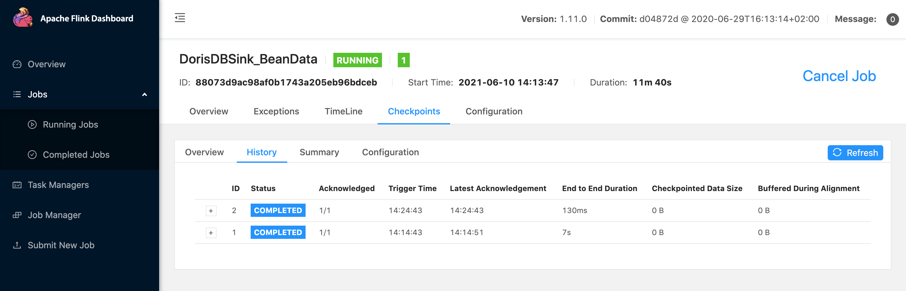

# 05_flinkConnector_Bean2StarRocks

## DDL

```
USE starrocks_demo;
CREATE TABLE `starrocks_demo`.`demo2_flink_tb1` (
   `name` VARCHAR(100) NOT NULL COMMENT "name",
   `score` INT(2) NOT NULL COMMENT "score"
) ENGINE=OLAP
    DUPLICATE KEY(`name`)
    COMMENT "OLAP"
    DISTRIBUTED BY HASH(`name`) BUCKETS 3
    PROPERTIES (
    "replication_num" = "1",
    "in_memory" = "false",
    "storage_format" = "V2"
);

```
## Performing

1. run [Bean2StarRocks](../FlinkDemo/src/main/scala/com/starrocks/flink/Bean2StarRocks.scala) directly in IDEA;
2. or package a jar and submit to flink-server;

> run.sh
```
#!/bin/bash

~/app/flink-1.11.0/bin/flink run \
-m yarn-cluster \
--yarnname Demo \
-c com.starrocks.flink.Bean2StarRocks \
-yjm 1048 -ytm 1048 \
-ys 1 -d  \
./StarRocks.jar
```
flink ui



## Verifications

```
MySQL [starrocks_demo]> select * from demo2_flink_tb1 limit 5;
+---------+-------+
| name    | score |
+---------+-------+
| lebron  |    37 |
| kobe    |    48 |
| stephen |    36 |
+---------+-------+
3 rows in set (0.01 sec)

MySQL [starrocks_demo]> select count(1) from demo2_flink_tb1;
+----------+
| count(1) |
+----------+
|       18 |
+----------+
1 row in set (0.04 sec)

MySQL [starrocks_demo]> select count(1) from demo2_flink_tb1;
+----------+
| count(1) |
+----------+
|       24 |
+----------+
1 row in set (0.02 sec)
```

