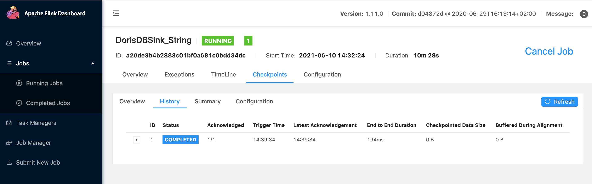

# 06_flinkConnector_Json2StarRocks

## DDL

```
CREATE TABLE `starrocks_demo`.`demo2_flink_tb2` (
    `name` VARCHAR(100) NOT NULL COMMENT "name",
    `score` INT(2) NOT NULL COMMENT "score"
) ENGINE=OLAP
    DUPLICATE KEY(`name`)
    COMMENT "OLAP"
    DISTRIBUTED BY HASH(`name`) BUCKETS 3
    PROPERTIES (
    "replication_num" = "1",
    "in_memory" = "false",
    "storage_format" = "V2"
);

```

## Performing

1. Run [Json2StarRocks](../FlinkDemo/src/main/scala/com/starrocks/flink/Json2StarRocks.scala) directly in IDEA;
2. or package a jar and submit to flink-server;

> run.sh

```
#!/bin/bash

~/app/flink-1.11.0/bin/flink run \
-m yarn-cluster \
--yarnname Demo \
-c com.starrocks.flink.Json2StarRocks \
-yjm 1048 -ytm 1048 \
-ys 1 -d  \
./StarRocks.jar
```

flink ui



## Verification

```
MySQL [starrocks_demo]> select * from demo2_flink_tb2 limit 5;
+---------+-------+
| name    | score |
+---------+-------+
| lebron  |    33 |
| lebron  |    38 |
| lebron  |    88 |
| kobe    |     6 |
| stephen |    67 |
+---------+-------+
5 rows in set (0.01 sec)

MySQL [starrocks_demo]> select count(1) from demo2_flink_tb2;
+----------+
| count(1) |
+----------+
|       18 |
+----------+
1 row in set (0.04 sec)

MySQL [starrocks_demo]> select sum(score) sc , name from demo2_flink_tb2 group by name;
+------+---------+
| sc   | name    |
+------+---------+
| 2067 | kobe    |
| 1825 | stephen |
| 2156 | lebron  |
+------+---------+
3 rows in set (0.03 sec)

MySQL [starrocks_demo]> select sum(score) sc , name from demo2_flink_tb2 group by name;
+------+---------+
| sc   | name    |
+------+---------+
| 2187 | lebron  |
| 2094 | kobe    |
| 1835 | stephen |
+------+---------+
3 rows in set (0.02 sec)

MySQL [starrocks_demo]> select sum(score) sc , name from demo2_flink_tb2 group by name;
+------+---------+
| sc   | name    |
+------+---------+
| 2094 | kobe    |
| 1835 | stephen |
| 2187 | lebron  |
+------+---------+
3 rows in set (0.01 sec)
```

