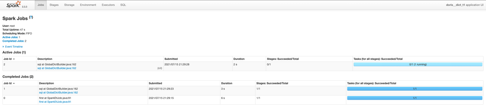

# 08_userPortrait_bitmapDict

> Building Bitmap data in DorisDB uses Roaring Bitmap, which needs INTEGER as INPUT.
> DorisDB provides a function named bitmap_dict, that can be called in spark-load job, 
> to map String values to Integer values when loading data to DorisDB. 
> 
> Note:
> When calling function bitmap_dict, some intermediate temp hive tables will be generated automatically.
> Submitting this job, needs write-privilege for hive tables.


# Data preparation

## Hive CLI

```SQL
-- Hive DDL
CREATE EXTERNAL TABLE `hive_dict_t1`(
    `k1` string,
    `uuid` string
    )
ROW FORMAT SERDE
 'org.apache.hadoop.hive.ql.io.parquet.serde.ParquetHiveSerDe'
STORED AS INPUTFORMAT
 'org.apache.hadoop.hive.ql.io.parquet.MapredParquetInputFormat'
OUTPUTFORMAT
 'org.apache.hadoop.hive.ql.io.parquet.MapredParquetOutputFormat'
TBLPROPERTIES ( 'parquet.compression'='snappy');

insert into hive_dict_t1 values ('k1','u1'),('k2','u2'),('k3','u3'),('k4','u4'),('k5','u5');
```


# DorisDB Directives

## DorisDB DDL

```
-- Hive resource
CREATE EXTERNAL RESOURCE "hive0"
PROPERTIES (
    "type" = "hive", 
    "hive.metastore.uris" = "thrift://master1:9083"
);

-- Dorisdb internal table
USE dorisdb_demo;
CREATE TABLE `dorisdb_demo`.`dict_t1` (
    `k1`  varchar(50) NULL  COMMENT "",
    `uuid`  bitmap  bitmap_union    NULL  COMMENT ""
) ENGINE=OLAP
AGGREGATE KEY(`k1` )
COMMENT "OLAP"
DISTRIBUTED BY HASH(`k1` ) BUCKETS 3
PROPERTIES (
    "replication_num" = "1",
    "in_memory" = "false",
    "storage_format" = "DEFAULT"
);

-- Dorisdb External Hive table
CREATE EXTERNAL TABLE hive_dict_t1
(
    k1 string,
    uuid string
)
ENGINE=hive
properties 
(
    "resource" = "hive0",
    "database" = "default",
    "table" = "hive_dict_t1"
);
```

## Spark resource

```
-- add broker1
MySQL [(none)]> ALTER SYSTEM ADD BROKER broker1 "master1:8000";
Query OK, 0 rows affected (0.04 sec)

-- yarn HA cluster mode
CREATE EXTERNAL RESOURCE "spark1"
PROPERTIES
(
    "type" = "spark",
    "spark.master" = "yarn",
    "spark.submit.deployMode" = "cluster",
    "spark.hadoop.yarn.resourcemanager.ha.enabled" = "true",
    "spark.hadoop.yarn.resourcemanager.ha.rm-ids" = "rm1,rm2",
    "spark.hadoop.yarn.resourcemanager.hostname.rm1" = "master1",
    "spark.hadoop.yarn.resourcemanager.hostname.rm2" = "worker1",
    "spark.hadoop.fs.defaultFS" = "hdfs://mycluster/",
    "working_dir" = "hdfs://mycluster/tmp/doris",
    "broker" = "broker1"
);
```

## Submit spark  job

```
USE dorisdb_demo;
LOAD LABEL dorisdb_demo.dict_t1
(
    DATA FROM TABLE hive_dict_t1
    INTO TABLE dict_t1
    SET
    (
       uuid=bitmap_dict(uuid)
    )
)
WITH RESOURCE 'spark1'
(
    "spark.executor.memory" = "2g",
    "spark.shuffle.compress" = "true",
    "spark.driver.memory" = "1g"
)
PROPERTIES
(
    "timeout" = "3600",
    "max_filter_ratio" = "0.2"
);
```

## Show load

```
MySQL [dorisdb_demo]> show load\G
*************************** 1. row ***************************
         JobId: 26023
         Label: dict_t1
         State: PENDING
      Progress: ETL:0%; LOAD:0%
          Type: SPARK
       EtlInfo: NULL
      TaskInfo: cluster:spark1; timeout(s):3600; max_filter_ratio:0.2
      ErrorMsg: NULL
    CreateTime: 2021-07-15 21:28:19
  EtlStartTime: NULL
 EtlFinishTime: NULL
 LoadStartTime: NULL
LoadFinishTime: NULL
           URL: NULL
    JobDetails: {"Unfinished backends":{},"ScannedRows":0,"TaskNumber":0,"All backends":{},"FileNumber":0,"FileSize":0}
1 row in set (0.00 sec)

MySQL [dorisdb_demo]> show load\G
*************************** 1. row ***************************
         JobId: 26023
         Label: dict_t1
         State: FINISHED
      Progress: ETL:100%; LOAD:100%
          Type: SPARK
       EtlInfo: unselected.rows=0; dpp.abnorm.ALL=0; dpp.norm.ALL=5
      TaskInfo: cluster:spark1; timeout(s):3600; max_filter_ratio:0.2
      ErrorMsg: NULL
    CreateTime: 2021-07-15 21:28:19
  EtlStartTime: 2021-07-15 21:28:46
 EtlFinishTime: 2021-07-15 21:30:20
 LoadStartTime: 2021-07-15 21:30:20
LoadFinishTime: 2021-07-15 21:30:24
           URL: http://worker1:20888/proxy/application_1626355110687_0002/
    JobDetails: {"Unfinished backends":{"00000000-0000-0000-0000-000000000000":[]},"ScannedRows":5,"TaskNumber":1,"All backends":{"00000000-0000-0000-0000-000000000000":[-1]},"FileNumber":0,"FileSize":0}
1 row in set (0.04 sec)
```

## Yarn job


## Spark job



## Verification

- Notes that uuid values  u1, u2, u3 ... were mapped to global unique integer values 1,2,3...

```
MySQL [dorisdb_demo]> desc dict_t1;
+-------+-------------+------+-------+---------+--------------+
| Field | Type        | Null | Key   | Default | Extra        |
+-------+-------------+------+-------+---------+--------------+
| k1    | VARCHAR(50) | Yes  | true  | NULL    |              |
| uuid  | BITMAP      | Yes  | false |         | BITMAP_UNION |
+-------+-------------+------+-------+---------+--------------+
2 rows in set (0.02 sec)

MySQL [dorisdb_demo]> select k1, bitmap_to_string(uuid) from dict_t1;
+------+--------------------------+
| k1   | bitmap_to_string(`uuid`) |
+------+--------------------------+
| k2   | 2                        |
| k3   | 3                        |
| k4   | 4                        |
| k1   | 1                        |
| k5   | 5                        |
+------+--------------------------+
5 rows in set (0.02 sec)
```

# FYI 

- hive temp tables are generated automatically

```
hive (default)> show tables;
OK
tab_name
doris_distinct_key_table_26014_26024
doris_global_dict_table_26014
doris_intermediate_hive_table_26014_26024
hive_dict_t1


hive (default)> select * from doris_distinct_key_table_26014_26024;
OK
doris_distinct_key_table_26014_26024.dict_key        doris_distinct_key_table_26014_26024.dict_column
u3        uuid
u4        uuid
u5        uuid
u1        uuid
u2        uuid
Time taken: 1.335 seconds, Fetched: 5 row(s)


hive (default)> select * from doris_global_dict_table_26014;
OK
doris_global_dict_table_26014.dict_key        doris_global_dict_table_26014.dict_value        doris_global_dict_table_26014.dict_column
u1        1        uuid
u2        2        uuid
u3        3        uuid
u4        4        uuid
u5        5        uuid
Time taken: 0.143 seconds, Fetched: 5 row(s)


hive (default)> select * from doris_intermediate_hive_table_26014_26024;
OK
doris_intermediate_hive_table_26014_26024.k1        doris_intermediate_hive_table_26014_26024.uuid
k3        3
k4        4
k5        5
k1        1
k2        2
Time taken: 0.126 seconds, Fetched: 5 row(s)
```

## License

DorisDB/demo is under the Apache 2.0 license. See the [LICENSE](../LICENSE) file for details.