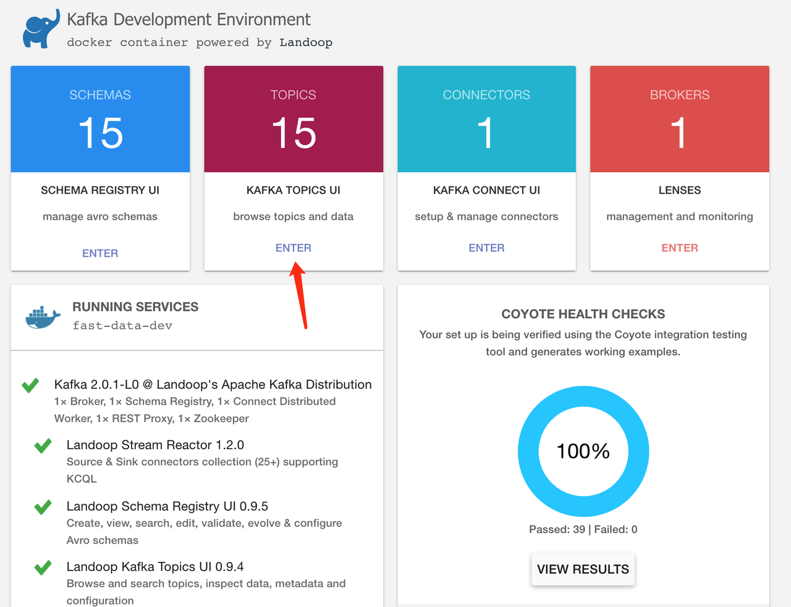
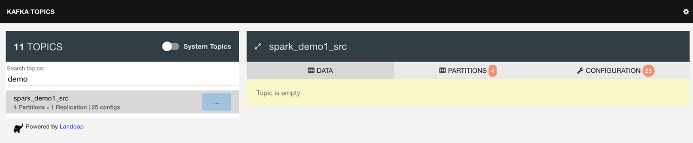
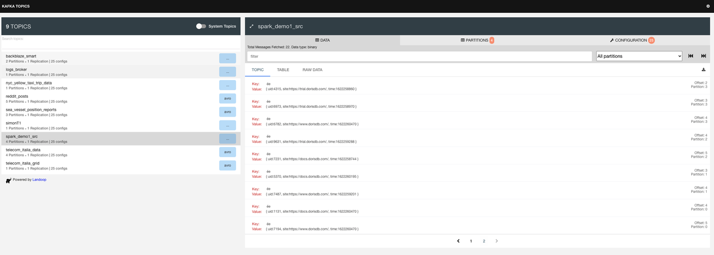
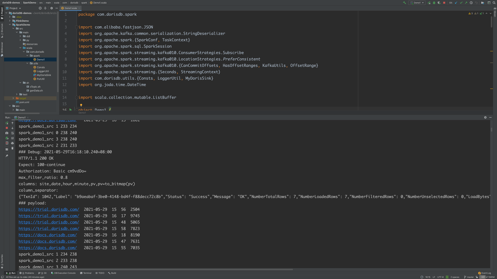
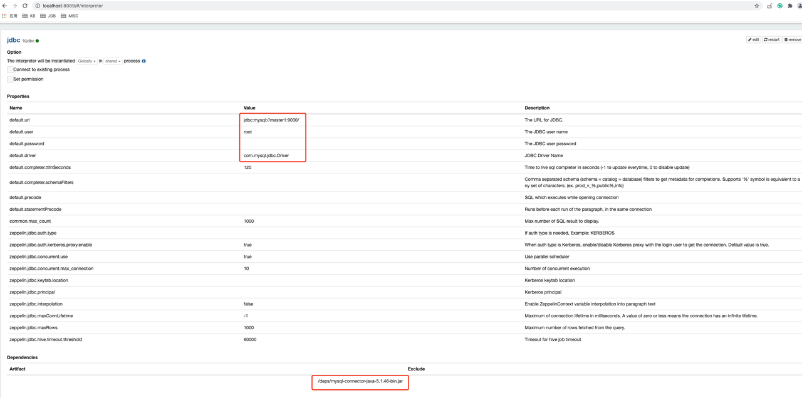
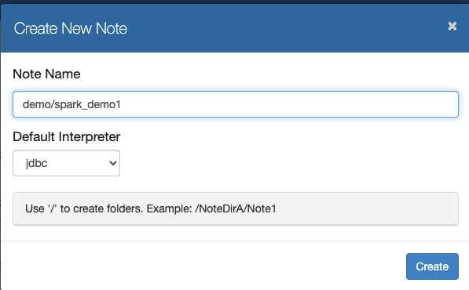
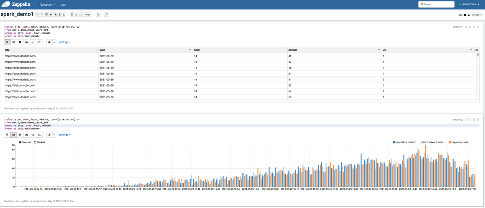
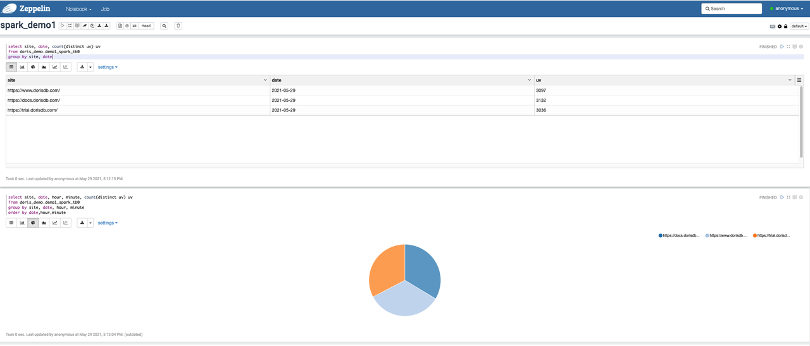

# 01_sparkStreaming2StarRocks

## 场景描述
通过流式计算，满足实时大屏上，当日各时段uv柱状趋势图的实时增长效果
数据流向

> mimic -> Kafka -> spark streaming -> stream load -> StarRocks -> zeppline UI (趋势图)

## 基础环境准备

### 1. Kafka
本地开发采用docker-landoop环境（也可以根据自己条件自建kafka集群）

```
### 拉取方式：
docker pull landoop/fast-data-dev

### 启动landoop
docker run --rm -d -p 2181:2181 -p 3030:3030 -p 7081-7083:8081-8083  -p 9581-9585:9581-9585 -p 9092:9092 -e ADV_HOST="${myip:=127.0.0.1}"  landoop/fast-data-dev:latest

### macbook 用open命令在浏览器打开landoop页面；windows电脑可以直接在浏览器访问下面链接
open http://127.0.0.1:3030
```

执行kafka主题创建脚本cTopic.sh创建测试主题spark_demo1_src ：
```
# cTopic.sh create spark_demo1_src  
                                                           
Created topic "spark_demo1_src".
```
页面里查看：



可以看到主题已经被创建，暂时还没有数据：



### 2. 模拟数据
采用python脚本，模拟生产json数据，通过kafka-console-sonsumer定时打入kafka。
生成器代码demo1_data_gen.py被包在genData.sh脚本中。

## 功能测试

### 1. 数据生成器

执行效果：2秒间隔，10以内随机行数，发往kafka主题：spark_demo1_src

```
#bash  ../sh/genData.sh 2 10 spark_demo1_src                                                                      Usage: ../sh/genData.sh topicName  interval
Sending time data to spark_demo1_src every 2 seconds...
>>>>>>>>>>>>>>>>>>>>>>>>>>>>>>>>>>>>>>>>>>>>>>>>>>>>>>>>>
```   

landoop内可以看到有数据写入：


### 2. DDL

```
CREATE TABLE `demo1_spark_tb0` (
    `site`   varchar(50) NULL COMMENT "",
    `date`   DATE     NULL  COMMENT "",
    `hour`   smallint NULL COMMENT "",
    `minute` smallint NULL COMMENT "",
    `uv`  BITMAP BITMAP_UNION
) ENGINE=OLAP
AGGREGATE KEY(`site`,`date`,  `hour` , `minute` )
COMMENT "OLAP"
DISTRIBUTED BY HASH(`site`) BUCKETS 10
PROPERTIES (
    "replication_num" = "1",
    "in_memory" = "false",
    "storage_format" = "DEFAULT"
);
```

### 3. 执行程序 

IDEA里编译执行 SparkDemo模块的com.starsocks.spark.SparkStreaming2StarRocks



### 4. 验证
mysql客户端登录StarRocks进行查询验证

```
MySQL [starsocks_demo]> select * from demo1_spark_tb0 limit 5;
+---------------------------+------------+------+--------+------+
| site                      | date       | hour | minute | uv   |
+---------------------------+------------+------+--------+------+
| https://docs.starsocks.com/ | 2021-05-29 |   14 |     45 | NULL |
| https://docs.starsocks.com/ | 2021-05-29 |   14 |     48 | NULL |
| https://docs.starsocks.com/ | 2021-05-29 |   15 |     18 | NULL |
| https://docs.starsocks.com/ | 2021-05-29 |   15 |     21 | NULL |
| https://docs.starsocks.com/ | 2021-05-29 |   15 |     29 | NULL |
+---------------------------+------------+------+--------+------+
5 rows in set (0.01 sec)

MySQL [starsocks_demo]> select count(distinct uv) uv  from demo1_spark_tb0 ;
+------+
| uv   |
+------+
|  146 |
+------+
1 row in set (0.02 sec)

MySQL [starsocks_demo]> select site, count(distinct uv) uv  from demo1_spark_tb0 group by site;
+----------------------------+------+
| site                       | uv   |
+----------------------------+------+
| https://www.starsocks.com/   |   71 |
| https://trial.starsocks.com/ |   42 |
| https://docs.starsocks.com/  |   63 |
+----------------------------+------+

MySQL [starsocks_demo]> select site,hour, count(distinct uv) uv  from demo1_spark_tb0 group by site,hour;
+----------------------------+------+------+
| site                       | hour | uv   |
+----------------------------+------+------+
| https://www.starsocks.com/   |   14 |    8 |
| https://www.starsocks.com/   |   15 |  150 |
| https://www.starsocks.com/   |   16 |  258 |
| https://trial.starsocks.com/ |   14 |    6 |
| https://trial.starsocks.com/ |   15 |  133 |
| https://docs.starsocks.com/  |   14 |    4 |
| https://docs.starsocks.com/  |   15 |  157 |
| https://docs.starsocks.com/  |   16 |  231 |
| https://trial.starsocks.com/ |   16 |  228 |
+----------------------------+------+------+
9 rows in set (0.01 sec)
```

## 可视化demo

### 1. 这里在Docker里拉取zeppelin

```
docker pull apache/zeppelin

# which myzeppelin
myzeppelin: aliased to docker run -p 8089:8080  -v /Users/simon/Documents/zep:/opt/zeppelin -v /Users/simon/Documents/zep/logs:/logs -v /Users/simon/Documents/zep/notebooks:/notebook   -e ZEPPELIN_LOG_DIR='/logs'  -e ZEPPELIN_NOTEBOOK_DIR='/notebook' -v /etc/localtime:/etc/localtime -v /Users/simon/Documents/zep/deps:/deps --rm  -d --name zeppelin apache/zeppelin:0.9.0; sleep 10; open http://localhost:8089
```

### 2. Zeppelin
- jdbc配置


  
- 创建notebook


  
### 3. 可视化效果
- 时序柱状图

> 用于实时大屏，刷新页面会看到柱状图逐渐增长



- 饼图

> 各站点访问占比




# License

StarRocks/demo is under the Apache 2.0 license. See the [LICENSE](../LICENSE) file for details.
