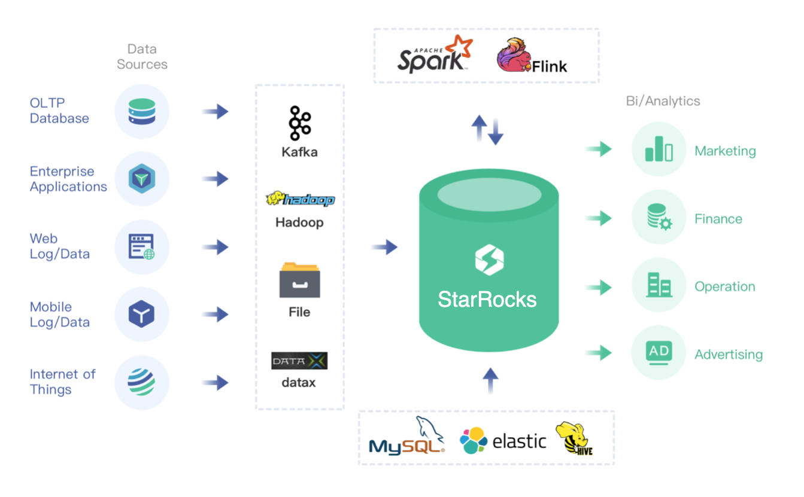

# DorisDB Demo cn

[](LICENSE)

本项目旨在提供完整的代码，帮助开发者快速了解各种场景的开发方法。



# 1. spark demo

[01_sparkStreaming2DorisDB](01_sparkStreaming2DorisDB.md)

```
spark streaming -> stream load -> DorisDB 
```
 
[02_sparkConnector2DorisDB](02_sparkConnector2DorisDB.md)  
```
DorisDB -> spark-connector -> etl -> stream load ->  DorisDB
```

[03_sparkLoad2DorisDB](03_sparkLoad2DorisDB.md)
```
Hive  -----> spark load -> spark etl ->   broker load  ->  DorisDB 
```
[04_sparkGenParquet](04_sparkGenParquet.md)

> Generate Parquet Data

# 2. flink demo

[05_flinkConnector_Bean2DorisDB](05_flinkConnector_Bean2DorisDB.md)
```
bean --->   flink-connector --->  DorisDB 
```
[06_flinkConnector_Json2DorisDB](06_flinkConnector_Json2DorisDB.md) 
```
json   -->   flink-connector --->  DorisDB
```
[07_flinkConnector_Sql2DorisDB](07_flinkConnector_Sql2DorisDB.md) 
```
flinkSql --> flin-connector -->  DorisDB 
``` 

## License

DorisDB/demo is under the Apache 2.0 license. See the [LICENSE](./LICENSE) file for details.
